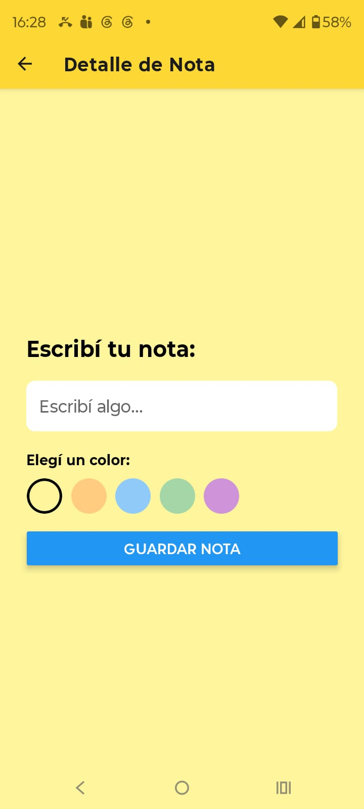
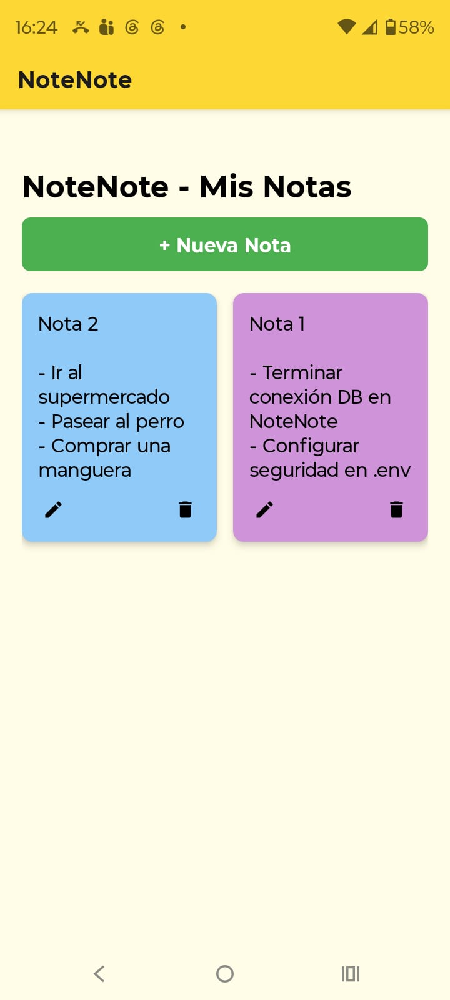

# NoteNote - Sistema de Gestión de Notas

Proyecto de Arquitectura y Diseño de Interfaces desarrollado con **React Native (Expo)** y **Node.js (MySQL)**.

## 🚀 Estructura del Proyecto
- `/backend`: Servidor API REST construido con Express y MySQL.
- `/frontend`: Aplicación móvil desarrollada con React Native y Expo.

## 🛠 Requisitos Previos
- [Node.js](https://nodejs.org/) (versión LTS recomendada).
- [MySQL Server](https://dev.mysql.com/downloads/mysql/) instalado y corriendo.
- [Expo Go](https://expo.dev/client) instalado en tu dispositivo móvil.

---

## ⚙️ Configuración Inicial

### 1. Backend
1. Entra a la carpeta: `cd backend`
2. Instala dependencias: `npm install`
3. Crea un archivo `.env` en la carpeta `/backend` y define la contraseña de tu base de datos:
   `DB_PASSWORD=tu_contraseña_mysql`
4. Asegúrate de tener creada la base de datos `notenote_db` en MySQL.
5. Inicia el servidor: `node server.js`

### 2. Frontend
1. Entra a la carpeta: `cd frontend`
2. Instala dependencias: `npm install`
3. Crea un archivo `.env` en la carpeta `/frontend` con la IP de tu PC:
   `EXPO_PUBLIC_API_URL=http://<IP_DE_TU_PC>:3000/api`
4. Inicia la aplicación: `npx expo start`

---

## 📡 Consideraciones de Conectividad y Firewall

Para que tu aplicación móvil pueda comunicarse con el servidor en tu computadora, debes permitir el tráfico en el puerto `3000` a través del Firewall de Windows:

1. **Abrir el Firewall:** Presiona la tecla Windows, escribe *Firewall de Windows con seguridad avanzada* y presiona Enter.
2. **Nueva Regla:** Haz clic en **Reglas de entrada** (panel izquierdo) y luego en **Nueva regla...** (panel derecho).
3. **Configurar el puerto:**
   - Selecciona **Puerto** > Siguiente.
   - Selecciona **TCP** y escribe `3000` en *Puertos locales específicos* > Siguiente.
   - Selecciona **Permitir la conexión** > Siguiente.
   - Deja marcadas las tres opciones (Dominio, Privado, Público) > Siguiente.
   - **Finalizar:** Ponle el nombre `NoteNote Backend` y haz clic en Finalizar.

> ⚠️ **Nota importante sobre conectividad:**
> Asegúrate siempre de que tu computadora y tu celular estén conectados a la misma red Wi-Fi. Si la conexión falla, verifica con el comando `ipconfig` en Windows que tu dirección IP (`192.168.x.x`) no haya cambiado y actualízala en tu archivo `.env`.